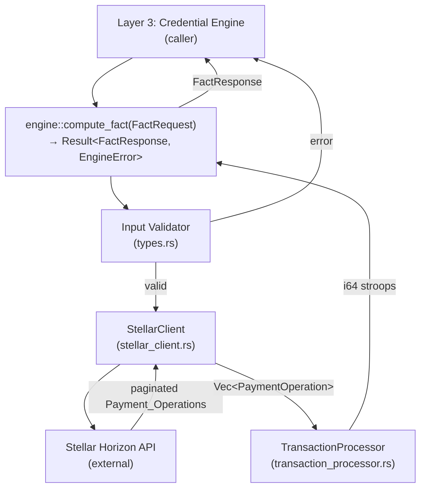

# Design Document

## Economic Fact Engine

---

## Overview

The Economic Fact Engine is Layer 2 of Project Blueprint. It sits between the Stellar blockchain (Layer 1) and the Credential Engine (Layer 3), accepting structured fact requests and returning computed economic facts derived exclusively from on-chain data.

The MVP computes a single fact type — **Revenue** — defined as the total canonical USDC received by a given Stellar wallet over a configurable trailing time window (1–365 days). The engine is a **Rust library crate** (`lib.rs`): it has no binary, no persistent state, and no database. Every invocation is a stateless, synchronous-from-the-caller's-perspective request-response cycle backed by async I/O.

Key design principles:

- **No raw data exposure.** The engine never returns individual transactions, counterparty addresses, or transaction IDs. Only the computed fact and its provenance metadata leave the system.
- **Integer arithmetic for precision.** All monetary values are represented internally as `i64` stroops (1 USDC = 10,000,000 stroops). Floating-point arithmetic is never used for monetary calculations.
- **Typed errors everywhere.** Every failure maps to one of 8 named `EngineError` variants. Rust's type system enforces exhaustive handling.
- **Retry-aware HTTP.** The Stellar client applies exponential backoff on transient Horizon failures, with independent per-page retry budgets.
- **Extensible fact model.** The `Fact` type is a tagged union (enum) — new fact variants can be added without touching existing serialization.

---

## Architecture



The call flow for a single `compute_fact` invocation:

1. **Validation** — `FactRequest` fields are validated; any failure returns immediately with the appropriate `EngineError`.
2. **Time window computation** — The trailing window `[now − window_days, now)` is computed in UTC.
3. **Horizon fetch** — `StellarClient` pages through all inbound payment operations for the wallet within the window, applying retry logic per page.
4. **Aggregation** — `TransactionProcessor` filters for canonical USDC inbound payments and sums their amounts in stroops.
5. **Response construction** — The stroop total is formatted to 7 decimal places; a `FactResponse` is assembled and returned.

---

## Components and Interfaces

### Module Structure

```
src/
├── lib.rs                    # Public API surface; re-exports; compute_fact entry point
├── types.rs                  # FactRequest, FactResponse, Fact enum, PaymentOperation
├── error.rs                  # EngineError enum + Display impl
├── stellar_client.rs         # StellarClient: HTTP, pagination, retry
└── transaction_processor.rs  # Filtering pipeline, stroop summation
```

### Public API (`lib.rs`)

```rust
/// Compute an economic fact for the given wallet and time window.
///
/// This is the sole public entry point of the library. Callers must provide
/// a `FactRequest`; the function returns either a `FactResponse` or a typed
/// `EngineError`. No raw transaction data is included in the response.
pub async fn compute_fact(request: FactRequest) -> Result<FactResponse, EngineError>
```

All other types exposed publicly: `FactRequest`, `FactResponse`, `Fact`, `EngineError`.

### `stellar_client.rs`

```rust
pub struct StellarClient {
    http: reqwest::Client,          // configured with 30s timeout
    base_url: String,               // Horizon base URL, injectable for testing
}

impl StellarClient {
    pub fn new(base_url: &str) -> Self;

    /// Fetch all inbound Payment_Operations for `wallet` in the time window.
    /// Handles pagination and per-page retry internally.
    pub async fn fetch_payments(
        &self,
        wallet: &str,
        window_start: DateTime<Utc>,
        window_end: DateTime<Utc>,
    ) -> Result<Vec<PaymentOperation>, EngineError>;
}
```

Internal helpers:

```rust
async fn fetch_page(
    &self,
    url: &str,
) -> Result<HorizonPageResponse, EngineError>;

async fn fetch_page_with_retry(
    &self,
    url: &str,
) -> Result<HorizonPageResponse, EngineError>;

fn backoff_duration(attempt: u32) -> Duration;
// Returns min(2^attempt seconds, 30s)
// attempt 0 → 1s, attempt 1 → 2s, attempt 2 → 4s
```

### `transaction_processor.rs`

```rust
pub struct TransactionProcessor;

impl TransactionProcessor {
    /// Filter and aggregate inbound USDC payments into a stroop total.
    ///
    /// Returns i64 stroops (never negative; any overflow returns
    /// EngineError::InternalComputationFailure).
    pub fn compute_revenue(
        ops: &[PaymentOperation],
        wallet: &str,
    ) -> Result<i64, EngineError>;
}
```

The processor applies this pipeline in order:

1. Retain only operations where `destination == wallet`.
2. Retain only operations where `asset_code == "USDC"` AND `asset_issuer == CANONICAL_USDC_ISSUER`.
3. Parse `amount` string to `i64` stroops (skip + log if null, missing, or non-numeric — no error).
4. Sum remaining stroop values using checked arithmetic.

### Formatting (`types.rs`)

```rust
/// Convert i64 stroops to a 7-decimal-place string.
/// 1 USDC = 10_000_000 stroops.
/// Truncates (does not round) any sub-stroop precision.
pub fn stroops_to_decimal_string(stroops: i64) -> String;
// e.g. 154325000000i64 → "15432.5000000"
// e.g. 0i64            → "0.0000000"
```

---

## Data Models

### `FactRequest`

```rust
#[derive(Debug, Clone, serde::Deserialize)]
pub struct FactRequest {
    /// Stellar G-address (56-char base32 starting with 'G')
    pub wallet_address: String,
    /// Fact type identifier — currently only "revenue" is supported
    pub fact_type: String,
    /// Trailing window in whole days; must be 1–365 inclusive
    pub window_days: u32,
}
```

Validation rules (enforced in `lib.rs` before any I/O):

| Field | Invalid condition | Error code |
|---|---|---|
| `wallet_address` | empty / whitespace | `MISSING_REQUIRED_FIELD` |
| `wallet_address` | not 56-char G-address | `INVALID_WALLET_ADDRESS` |
| `fact_type` | empty / whitespace | `MISSING_REQUIRED_FIELD` |
| `fact_type` | not "revenue" | `UNSUPPORTED_FACT_TYPE` |
| `window_days` | 0 | `INVALID_TIME_WINDOW` |
| `window_days` | > 365 | `INVALID_TIME_WINDOW` |

### `FactResponse`

```rust
#[derive(Debug, Clone, serde::Serialize, serde::Deserialize)]
pub struct FactResponse {
    /// The computed fact (tagged union — currently only Revenue variant)
    pub fact: Fact,
    /// Wallet this fact was computed for
    pub wallet_address: String,
    /// Trailing window in days used for this computation
    pub window_days: u32,
    /// UTC timestamp when computation was performed (ISO 8601, second precision)
    pub computed_at: String,   // e.g. "2024-01-15T12:00:00Z"
}
```

### `Fact` enum

```rust
#[derive(Debug, Clone, serde::Serialize, serde::Deserialize)]
#[serde(tag = "type", rename_all = "snake_case")]
pub enum Fact {
    Revenue {
        /// Total inbound USDC, formatted to exactly 7 decimal places
        #[serde(serialize_with = "serialize_value_as_string")]
        value: String,
        /// Always "USDC" for Revenue variant
        currency: String,
    },
    // Future variants: CustomerCount, ActivityScore, TreasuryBalance, …
}
```

The `#[serde(tag = "type")]` attribute produces self-describing JSON:

```json
{
  "type": "revenue",
  "value": "15432.5000000",
  "currency": "USDC"
}
```

Adding a new variant (e.g., `CustomerCount`) requires only adding an enum arm; existing Revenue serialization is unaffected.

### `EngineError`

```rust
#[derive(Debug, Clone)]
pub enum EngineError {
    InvalidWalletAddress(String),
    InvalidTimeWindow(String),
    MissingRequiredField(String),
    UnsupportedFactType(String),
    HorizonApiFailure { status: u16, message: String },
    NetworkTimeout(String),
    HorizonMaxRetriesExceeded(String),
    InternalComputationFailure(String),
}
```

All `String` payloads are human-readable descriptions ≤ 256 characters. They never contain stack traces, file paths, memory addresses, private key material, or raw wallet data.

Serialized form (for callers that need JSON errors):

```json
{
  "error_code": "INVALID_WALLET_ADDRESS",
  "message": "Wallet address must be a 56-character base32 string starting with 'G'"
}
```

### `PaymentOperation` (internal)

```rust
#[derive(Debug, Clone, serde::Deserialize)]
pub(crate) struct PaymentOperation {
    pub id: String,
    #[serde(rename = "type")]
    pub op_type: String,               // "payment" | "path_payment_strict_send" | "path_payment_strict_receive"
    pub source_account: String,
    pub to: String,                    // destination account
    pub asset_code: Option<String>,
    pub asset_issuer: Option<String>,
    pub amount: Option<String>,        // Horizon returns amounts as strings
    pub created_at: String,            // ISO 8601
}
```

The `id`, `source_account`, and individual `amount` fields are used internally during processing and **never appear in `FactResponse`**.

### Horizon API types (internal deserialization targets)

```rust
#[derive(serde::Deserialize)]
pub(crate) struct HorizonPageResponse {
    #[serde(rename = "_embedded")]
    pub embedded: HorizonEmbedded,
    #[serde(rename = "_links")]
    pub links: HorizonLinks,
}

#[derive(serde::Deserialize)]
pub(crate) struct HorizonEmbedded {
    pub records: Vec<PaymentOperation>,
}

#[derive(serde::Deserialize)]
pub(crate) struct HorizonLinks {
    pub next: Option<HorizonLink>,
}

#[derive(serde::Deserialize)]
pub(crate) struct HorizonLink {
    pub href: String,
}
```

---

## Precision Strategy

Stellar represents all asset amounts with 7 decimal places using an integer unit called a **stroop**: 1 USDC = 10,000,000 stroops. Horizon returns amounts as decimal strings (e.g., `"15432.5000000"`).

The engine converts once on ingress and converts back once on egress:

```
Ingress:  "15432.5000000" → parse → 154325000000i64 (stroops)
Egress:   154325000000i64 → format → "15432.5000000"
```

**Ingress parsing:**

```rust
fn parse_stroop_amount(s: &str) -> Option<i64> {
    // Split on '.', validate exactly 7 decimal digits, reconstruct as i64.
    // Returns None if null, missing, non-numeric, or > 7 decimal places.
}
```

**Egress formatting (`stroops_to_decimal_string`):**

```rust
fn stroops_to_decimal_string(stroops: i64) -> String {
    let whole = stroops / 10_000_000;
    let frac  = stroops % 10_000_000;
    format!("{}.{:07}", whole, frac.abs())
}
```

**Summation:**

```rust
let total: i64 = amounts
    .iter()
    .try_fold(0i64, |acc, &x| acc.checked_add(x))
    .ok_or(EngineError::InternalComputationFailure(
        "Stroop accumulator overflow".into()
    ))?;
```

Checked addition prevents silent overflow. An overflow returns `INTERNAL_COMPUTATION_FAILURE`.

---

## Correctness Properties

*A property is a characteristic or behavior that should hold true across all valid executions of a system — essentially, a formal statement about what the system should do. Properties serve as the bridge between human-readable specifications and machine-verifiable correctness guarantees.*

**Property reflection (pre-consolidation):** Before writing properties, redundant criteria were identified and merged:
- Requirements 1.2, 1.4, and 1.8 (all `MISSING_REQUIRED_FIELD` edge cases) are covered as edge cases by the generators for Property 1.
- Requirements 3.3 and 3.4 (non-canonical USDC exclusion, null issuer exclusion) are unified into Property 6 with a single generator that produces both conditions.
- Requirements 3.5 (zero result for empty input) is subsumed by Property 5 when the generator produces an empty list.
- Requirements 4.2 and 4.4 (JSON validity, round-trip) are unified into a single round-trip property (Property 9).
- Requirements 5.3 and 5.4 (exhaustive error codes) are compile-time guarantees in Rust; no runtime property needed.

### Property 1: Valid requests are accepted without validation errors

*For any* wallet address that is a 56-character base32 string starting with `G`, any `window_days` in `[1, 365]`, and fact type `"revenue"`, the engine's input validation SHALL succeed without returning an error.

**Validates: Requirements 1.1**

### Property 2: Invalid wallet addresses are rejected

*For any* string that is NOT a 56-character base32 string starting with `G` (and is non-empty), the engine SHALL return `EngineError::InvalidWalletAddress`.

**Validates: Requirements 1.3**

### Property 3: Out-of-range time windows are rejected

*For any* integer `n ≤ 0` or `n > 365`, passing `n` as `window_days` SHALL cause the engine to return `EngineError::InvalidTimeWindow`.

**Validates: Requirements 1.5, 1.6**

### Property 4: Time window bounds are computed correctly

*For any* `window_days` in `[1, 365]` and any fixed reference timestamp `now`, the computed window start SHALL equal `now − Duration::days(window_days)` and the window end SHALL equal `now`.

**Validates: Requirements 1.7**

### Property 5: Revenue aggregation is correct for all input sets

*For any* list of `PaymentOperation` values where a subset are canonical USDC inbound payments to the target wallet with valid numeric amounts, the `TransactionProcessor::compute_revenue` function SHALL return exactly the sum of the stroop amounts of the qualifying subset — and no contribution from non-qualifying operations.

**Validates: Requirements 3.1, 3.5, 3.7**

### Property 6: Non-canonical and null-issuer assets are always excluded

*For any* `PaymentOperation` where either (a) `asset_code != "USDC"`, (b) `asset_issuer != canonical issuer`, or (c) `asset_issuer` is `None`, the operation SHALL contribute exactly `0` stroops to the revenue total, regardless of any other field values.

**Validates: Requirements 3.3, 3.4**

### Property 7: Self-payments are always included

*For any* canonical USDC `PaymentOperation` where `source_account == destination == wallet_address`, that operation SHALL be included in the revenue total.

**Validates: Requirements 3.6**

### Property 8: Operations with invalid amounts are silently skipped

*For any* list of `PaymentOperation` values where some have null, missing, or non-numeric `amount` fields and others have valid amounts, `compute_revenue` SHALL return the sum of only the valid amounts — equal to the result that would be produced if the invalid-amount operations were not present at all.

**Validates: Requirements 3.8**

### Property 9: Fact_Response serialization round-trip

*For any* `FactResponse` value (with any valid `wallet_address`, `window_days`, `computed_at`, and `Fact::Revenue { value, currency }`), serializing to JSON and deserializing back SHALL produce a value structurally equal to the original, with `value` preserved to all 7 decimal places and `computed_at` to second precision.

**Validates: Requirements 4.2, 4.4**

### Property 10: Computed value is always serialized as a JSON string

*For any* i64 stroop amount (including 0 and `i64::MAX / 10_000_000`), the `value` field in the serialized `Fact::Revenue` JSON SHALL be a JSON string token (not a JSON number).

**Validates: Requirements 4.3**

### Property 11: All error descriptions are ≤ 256 characters and contain no sensitive data

*For any* `EngineError` variant with a maximum-length human-readable description, `description.len() ≤ 256` SHALL hold, and the description SHALL NOT match patterns for stack traces (`at src/`), absolute file paths (`/home/`, `/usr/`), memory addresses (`0x[0-9a-f]+`), or private key material.

**Validates: Requirements 5.1, 5.2**

### Property 12: Backoff durations follow capped exponential sequence

*For any* retry attempt index `n` in `[0, 2]`, the backoff duration SHALL equal `min(2^n seconds, 30 seconds)` — specifically: attempt 0 → 1s, attempt 1 → 2s, attempt 2 → 4s.

**Validates: Requirements 6.2**

### Property 13: Non-retryable 4xx errors produce exactly one HTTP request

*For any* HTTP status code `c` where `400 ≤ c < 500` and `c ≠ 429`, when the mock Horizon server returns `c`, the `StellarClient` SHALL make exactly 1 HTTP request and return `EngineError::HorizonApiFailure`.

**Validates: Requirements 6.4**

### Property 14: Retryable errors exhaust retry budget before failing

*For any* sequence of HTTP responses consisting of N consecutive 429 or 5xx responses (N ≥ 4) to the same page URL, the `StellarClient` SHALL make exactly 4 HTTP attempts (1 initial + 3 retries) and return `EngineError::HorizonMaxRetriesExceeded`.

**Validates: Requirements 6.1, 6.3**

### Property 15: Existing fact variants round-trip through serde unchanged

*For any* `Fact::Revenue` value, serializing to JSON and deserializing SHALL recover the original variant with identical field values. The deserialized `"type"` field SHALL equal `"revenue"`.

**Validates: Requirements 7.1, 7.3**

### Property 16: Unknown fact types are rejected before any computation

*For any* string `s` where `s ≠ "revenue"` (and `s` is non-empty), passing `s` as `fact_type` in a `FactRequest` SHALL cause the engine to return `EngineError::UnsupportedFactType` without making any HTTP requests to Horizon.

**Validates: Requirements 7.2**

---

## Error Handling

### Error mapping table

| Condition | Error code | Notes |
|---|---|---|
| `wallet_address` empty/whitespace | `MISSING_REQUIRED_FIELD` | Checked before format validation |
| `wallet_address` not 56-char G-address | `INVALID_WALLET_ADDRESS` | Regex: `^G[A-Z2-7]{55}$` |
| `fact_type` empty/whitespace | `MISSING_REQUIRED_FIELD` | — |
| `fact_type` not "revenue" | `UNSUPPORTED_FACT_TYPE` | — |
| `window_days == 0` | `INVALID_TIME_WINDOW` | — |
| `window_days > 365` | `INVALID_TIME_WINDOW` | — |
| Horizon HTTP 429 or 5xx, retries exhausted | `HORIZON_MAX_RETRIES_EXCEEDED` | After 4 attempts |
| Horizon HTTP 4xx (not 429) | `HORIZON_API_FAILURE` | No retry |
| Horizon HTTP 5xx, first attempt | `HORIZON_API_FAILURE` temporarily → retry → if exhausted → `HORIZON_MAX_RETRIES_EXCEEDED` | |
| Horizon response body unparseable | `HORIZON_API_FAILURE` | `status: 0` to indicate parse failure |
| `reqwest` timeout error | `NETWORK_TIMEOUT` | 30s configured on `Client` |
| `reqwest` non-timeout connection error | `HORIZON_API_FAILURE` | — |
| Stroop accumulator overflow | `INTERNAL_COMPUTATION_FAILURE` | Checked arithmetic |

### Error propagation

The `?` operator propagates `EngineError` from `stellar_client` and `transaction_processor` through to `compute_fact`. No error is swallowed or converted to a different type mid-chain. `EngineError` implements `std::error::Error` and `Display` for compatibility with error-handling crates.

### What errors must NOT contain

- Stack trace strings (`at src/`, `panicked at`)
- Absolute file system paths
- Hex memory addresses
- Any portion of the wallet address beyond the first 6 characters (for debugging only; omit entirely in production builds)
- Raw Horizon response bodies

---

## Testing Strategy

### Crate dependencies

```toml
[dependencies]
reqwest   = { version = "0.12", features = ["json"] }
tokio     = { version = "1",    features = ["full"] }
serde     = { version = "1",    features = ["derive"] }
serde_json = "1"
chrono    = { version = "0.4",  features = ["serde"] }

[dev-dependencies]
proptest  = "1"
tokio     = { version = "1", features = ["full", "test-util"] }
wiremock  = "0.6"   # HTTP mock server for Horizon integration tests
```

`proptest` is the property-based testing library. Each correctness property maps to one `proptest!` block with a minimum of 100 iterations (proptest default).

### Unit tests — `transaction_processor.rs`

Target: pure aggregation logic, no I/O.

- **Example**: Empty operation list → `"0.0000000"`.
- **Example**: Single canonical USDC payment → correct stroop conversion.
- **Example**: Self-payment is included; outbound-only payment is excluded.
- **Example**: Operation with null amount is skipped; remaining ops are summed correctly.
- **PBT (Prop 5)**: `proptest` generates arbitrary `Vec<PaymentOperation>` with controlled USDC/non-USDC ratio; assert sum equals expected.
- **PBT (Prop 6)**: Generator produces operations with random asset codes and issuers (including None); assert non-canonical contribute 0.
- **PBT (Prop 7)**: Generator produces self-payment operations; assert they are always included.
- **PBT (Prop 8)**: Generator produces operations with randomly valid/null/non-numeric amounts; assert only valid ones are summed.

### Unit tests — `types.rs` (formatting and validation)

- **PBT (Prop 2)**: `proptest` generates random non-G-address strings; assert `INVALID_WALLET_ADDRESS`.
- **PBT (Prop 3)**: `proptest` generates integers outside `[1, 365]`; assert `INVALID_TIME_WINDOW`.
- **PBT (Prop 4)**: `proptest` generates `window_days` in `[1, 365]` and a fixed `now`; assert window bounds are exact.
- **PBT (Prop 10)**: `proptest` generates random i64 stroop values; serialize `Fact::Revenue`; parse JSON and assert `value` field is a JSON string.
- **PBT (Prop 11)**: Instantiate all `EngineError` variants; assert description length and absence of sensitive patterns.
- **PBT (Prop 12)**: For attempt index 0, 1, 2 assert `backoff_duration(n) == min(2^n * 1s, 30s)`.

### Unit tests — `stellar_client.rs` (retry logic, with `wiremock`)

- **PBT (Prop 13)**: `proptest` generates 4xx codes (excluding 429); mock returns that code once; assert 1 HTTP request and `HORIZON_API_FAILURE`.
- **PBT (Prop 14)**: Mock returns 429/5xx 4 consecutive times; assert 4 HTTP requests and `HORIZON_MAX_RETRIES_EXCEEDED`.
- **Example (Req 6.3)**: After 4 failures → `HORIZON_MAX_RETRIES_EXCEEDED`.
- **Example (Req 2.4)**: Mock timeout → `NETWORK_TIMEOUT`.
- **Example (Req 2.5)**: Mock empty records response → empty `Vec`, no error.

### Integration tests — `stellar_client.rs` (pagination, with `wiremock`)

- **PBT (Prop from Req 2.2)**: `wiremock` serves N random pages (N in 1–20 range via proptest); assert all records returned and stop conditions respected.
- **Example**: Time-bound early stop — page contains record older than window start; assert no further pages fetched.

### Serde round-trip tests

- **PBT (Prop 9)**: `proptest` generates `FactResponse` values with random fields; assert `serde_json::from_str(serde_json::to_string(&r).unwrap()) == r`.
- **PBT (Prop 15)**: Generate `Fact::Revenue` with random string fields; assert round-trip equality and `"type": "revenue"` presence.

### Property test configuration

Each `proptest!` block runs the default 256 iterations. Each test carries a comment tag in the format:

```rust
// Feature: economic-fact-engine, Property 5: Revenue aggregation is correct for all input sets
```

### What is NOT property-tested

- Horizon API availability and response latency — these are integration/smoke concerns.
- `computed_at` timestamp wall-clock accuracy — tested with a deterministic clock injected via a trait.
- `EngineError` exhaustiveness — enforced at compile time by Rust's exhaustive `match`.

---

## Crate Structure Summary

```toml
[package]
name = "economic-fact-engine"
version = "0.1.0"
edition = "2024"

[lib]
name = "economic_fact_engine"
path = "src/lib.rs"

[dependencies]
reqwest    = { version = "0.12", features = ["json"] }
tokio      = { version = "1",    features = ["full"] }
serde      = { version = "1",    features = ["derive"] }
serde_json = "1"
chrono     = { version = "0.4",  features = ["serde"] }

[dev-dependencies]
proptest  = "1"
wiremock  = "0.6"
```

The `src/main.rs` stub present in the repository can be deleted or ignored — the library entry point is `src/lib.rs`.
