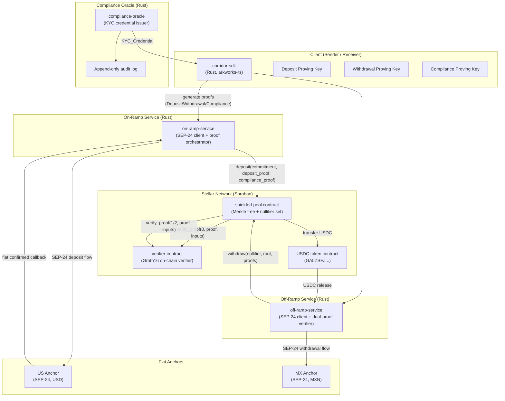

# Design Document

## Private Cross-Border Remittance Corridor

---

## Overview

The Private Remittance Corridor is a zero-knowledge privacy layer on top of Stellar's payment infrastructure that enables confidential USD→MXN cross-border transfers. The system combines a Soroban-based shielded commitment pool, on-chain Groth16 proof verification via CAP-0059, client-side proving with arkworks-rs, and SEP-24 anchor integrations for fiat on/off-ramp.

**Core privacy guarantee**: no on-chain record ever contains a transfer amount, sender identity, or receiver identity in plaintext. All value is transferred as cryptographic commitments; amounts are hidden inside Groth16 zero-knowledge proofs.

**Technology choices and rationale**:
- **Rust throughout**: Soroban SDK is Rust-native; using the same language for contracts and off-chain services eliminates FFI boundaries and ensures consistent type safety.
- **Groth16 / BLS12-381 via CAP-0059**: BLS12-381 pairing operations are available as Soroban host functions on Stellar mainnet. Groth16 produces constant 192-byte proofs regardless of circuit complexity, making on-chain verification gas-predictable.
- **SHA-256 as the single hash function**: Available as a Soroban host function (`env.compute_hash_sha256`), eliminates Pedersen hash ambiguity across environments, and guarantees identical digests in-circuit (via `ark-crypto-primitives` SHA-256 gadget) and on-chain.
- **Incremental Merkle tree, depth 20, SHA-256 nodes**: Supports 2^20 ≈ 1M commitments. The incremental structure requires only O(depth) = 20 storage writes per insert (sibling hashes along the rightmost path), keeping per-insert costs predictable.
- **Amounts as i64 stroops**: Matches Stellar's native asset representation. AML threshold = 99,999,999,999 stroops (strictly less than 100,000,000,000).
- **Proof bytes: 192 bytes** (2× compressed G1 = 2×48 bytes, 1× compressed G2 = 96 bytes). Public inputs: 32-byte big-endian scalars, length-prefixed.
- **Client-side proving only**: Proving keys never leave the client. The Soroban contract stores only verification keys (immutable).
- **serde/serde_json for off-chain serialization**: Standard Rust ecosystem crates for all off-chain data interchange.


---

## Architecture

### System Architecture Diagram



### Data Flow: Deposit

```
1. Sender → Compliance Oracle: request KYC_Credential
2. Sender (SDK) → generate Note (denomination, salt, receiver_pk)
3. SDK → compute Commitment = SHA-256(denomination_be || salt_be || receiver_pk)
4. SDK → prove Deposit_Circuit: Proof_D(Commitment; denomination, salt, receiver_pk)
5. SDK → prove Compliance_Circuit: Proof_C(VK_digest, epoch; denomination, credential, secret_key)
6. on-ramp-service → SEP-24 interactive deposit with US anchor (USD → USDC)
7. Anchor confirms → on-ramp-service builds Soroban tx:
   shielded_pool.deposit(commitment, proof_d_bytes, proof_c_bytes, compliance_public_inputs)
8. Soroban tx executes atomically:
   a. shielded_pool calls verifier.verify_proof(0, proof_d, [commitment])
   b. shielded_pool calls verifier.verify_proof(2, proof_c, [vk_digest, epoch])
   c. Both true → insert commitment into Merkle tree; increment next_index
   d. Pull USDC from on-ramp escrow account into pool account
   e. Emit event: {commitment, leaf_index}
9. SDK receives leaf_index → stores Note locally (denomination, salt, receiver_pk, leaf_index)
```

### Data Flow: Withdrawal

```
1. Receiver (SDK) → fetch current Merkle_Root from shielded_pool.get_root()
2. SDK → fetch Merkle_Path for leaf_index from indexer / merkle_path endpoint
3. SDK → compute Nullifier = SHA-256(salt || receiver_pk)
4. SDK → prove Withdrawal_Circuit: Proof_W(root, nullifier; denomination, salt, receiver_pk, path)
5. SDK → prove Compliance_Circuit: Proof_C(VK_digest, epoch; denomination, credential, secret_key)
6. off-ramp-service receives Withdrawal_Request with (proof_w, proof_c, nullifier, root, anchor_details)
7. off-ramp-service builds Soroban tx:
   shielded_pool.withdraw(nullifier, root, proof_w_bytes, proof_c_bytes, compliance_inputs)
8. Soroban tx executes atomically:
   a. verifier.verify_proof(1, proof_w, [root, nullifier]) == true
   b. verifier.verify_proof(2, proof_c, [vk_digest, epoch]) == true
   c. nullifier not in spent set → insert into spent set
   d. Transfer USDC from pool to off-ramp account
   e. Emit event: {nullifier, leaf_index}
9. off-ramp-service → SEP-24 withdrawal with MX anchor (USDC → MXN)
10. Anchor confirms → emit settlement event {nullifier, timestamp}
```


---

## Components and Interfaces

### 1. `shielded-pool` — Soroban Contract

The shielded pool is the on-chain core. It owns the USDC, maintains the incremental Merkle tree, and enforces that every state change is accompanied by a valid ZK proof.

**Crate**: `contracts/shielded-pool` (soroban-sdk)

**Entry points**:

```rust
/// Initialize the pool. Called once at deployment.
/// Stores the verifier contract address and USDC asset.
pub fn initialize(
    env: Env,
    admin: Address,
    verifier_contract: Address,
    usdc_asset: Address,
) -> Result<(), PoolError>;

/// Deposit a commitment into the Merkle tree.
/// Requires a valid Deposit_Circuit proof (circuit_id=0) and
/// a valid Compliance_Circuit proof (circuit_id=2).
/// Atomically pulls USDC from the caller and inserts the commitment.
pub fn deposit(
    env: Env,
    commitment: BytesN<32>,
    deposit_proof: Bytes,          // 192 bytes
    deposit_public_inputs: Vec<BytesN<32>>,  // [commitment]
    compliance_proof: Bytes,       // 192 bytes
    compliance_public_inputs: Vec<BytesN<32>>, // [vk_digest, epoch_be]
    amount: i64,                   // stroops; validated > 0
) -> Result<u32, PoolError>;      // returns leaf_index

/// Withdraw from the pool using a Withdrawal proof and Compliance proof.
/// Atomically records the nullifier and transfers USDC to recipient.
pub fn withdraw(
    env: Env,
    nullifier: BytesN<32>,
    merkle_root: BytesN<32>,
    withdrawal_proof: Bytes,       // 192 bytes
    withdrawal_public_inputs: Vec<BytesN<32>>, // [merkle_root, nullifier]
    compliance_proof: Bytes,
    compliance_public_inputs: Vec<BytesN<32>>,
    recipient: Address,
) -> Result<(), PoolError>;

/// Returns the current Merkle root.
pub fn get_root(env: Env) -> BytesN<32>;

/// Returns the current leaf count (next insertion index).
pub fn get_leaf_count(env: Env) -> u32;
```

**Events emitted**:

```rust
// On successful deposit:
env.events().publish(("deposit",), (commitment, leaf_index));

// On successful withdrawal:
env.events().publish(("withdrawal",), (nullifier, leaf_index));
```

### 2. `verifier-contract` — Soroban Contract

A stateless (storage-only for VKs) on-chain Groth16 verifier. Uses CAP-0059 BLS12-381 host functions.

**Crate**: `contracts/verifier-contract` (soroban-sdk)

**Entry points**:

```rust
/// Initialize with verification keys for all three circuits.
/// VKs are stored as persistent contract data and are NOT modifiable
/// after deployment except via authorized rotation (multisig).
pub fn initialize(
    env: Env,
    admin: Address,          // 3-of-5 multisig account
    vk_deposit: Bytes,       // serialized VK for circuit_id=0
    vk_withdrawal: Bytes,    // serialized VK for circuit_id=1
    vk_compliance: Bytes,    // serialized VK for circuit_id=2
) -> Result<(), VerifierError>;

/// Verify a Groth16 proof for the given circuit.
/// Returns false (never panics) on any malformed input.
/// circuit_id: 0=Deposit, 1=Withdrawal, 2=Compliance
pub fn verify_proof(
    env: Env,
    circuit_id: u32,
    proof_bytes: Bytes,                   // exactly 192 bytes
    public_inputs: Vec<BytesN<32>>,       // big-endian scalars
) -> bool;

/// Authorized VK rotation (emergency only).
/// Requires 3-of-5 multisig authorization.
pub fn rotate_vk(
    env: Env,
    circuit_id: u32,
    new_vk: Bytes,
) -> Result<(), VerifierError>;

/// Returns SHA-256 digest of a stored VK for independent verification.
pub fn get_vk_digest(env: Env, circuit_id: u32) -> BytesN<32>;
```

**Initialization event** (emitted at `initialize`):

```rust
env.events().publish(("init",), (
    vk_deposit_digest,    // SHA-256 of VK bytes
    vk_withdrawal_digest,
    vk_compliance_digest,
));
```

**circuit_id routing** inside `verify_proof`:

```rust
let vk_bytes = match circuit_id {
    0 => env.storage().persistent().get::<_, Bytes>(&DataKey::VkDeposit),
    1 => env.storage().persistent().get::<_, Bytes>(&DataKey::VkWithdrawal),
    2 => env.storage().persistent().get::<_, Bytes>(&DataKey::VkCompliance),
    _ => return false,  // unknown circuit_id: graceful false, never panic
};
```


### 3. `zk-circuits` — Groth16 Circuit Definitions

All circuits are R1CS constraints written using `ark-relations` and `ark-crypto-primitives`. Proving and verification key generation uses `ark-groth16` + `ark-bls12-381`.

**Crate**: `crates/zk-circuits` (native Rust + std)

#### Deposit Circuit

```
Curve: BLS12-381
Public inputs (field elements, 32 bytes each):
  [0]: commitment    — SHA-256(denomination_be || salt_be || receiver_pk_be)

Private inputs (witnesses):
  denomination       : i64 (as 8-byte big-endian, range-checked > 0)
  salt               : [u8; 32]
  receiver_pk        : [u8; 32]  (shielded public key)

Constraints:
  1. sha256_gadget(denomination_be || salt_be || receiver_pk_be) == commitment
  2. denomination > 0  (range check)
```

#### Withdrawal Circuit

```
Curve: BLS12-381
Public inputs:
  [0]: merkle_root   — current Merkle tree root
  [1]: nullifier     — SHA-256(salt || receiver_pk)

Private inputs:
  denomination       : i64
  salt               : [u8; 32]
  receiver_pk        : [u8; 32]
  merkle_path        : [[u8; 32]; 20]   (sibling hashes, root-to-leaf order)
  merkle_path_indices: [bool; 20]       (left=false / right=true at each level)

Constraints:
  1. commitment = sha256_gadget(denomination_be || salt_be || receiver_pk_be)
  2. merkle_root == incremental_merkle_verify(commitment, merkle_path, merkle_path_indices)
  3. nullifier == sha256_gadget(salt || receiver_pk)
  4. denomination > 0
```

#### Compliance Circuit

```
Curve: BLS12-381
Public inputs:
  [0]: vk_digest     — SHA-256 of the Compliance_Oracle's current verification key bytes
  [1]: epoch_be      — current epoch timestamp (u64 as big-endian 32-byte scalar)

Private inputs:
  denomination       : i64
  credential_commitment: [u8; 32]  — Hash(identity_attributes)
  credential_expiry  : u64         — Unix timestamp
  oracle_signature   : [u8; 64]    — Ed25519 or BLS signature over credential_commitment
  holder_secret_key  : [u8; 32]

Constraints:
  1. denomination < AML_THRESHOLD   (range check: denomination < 99_999_999_999 + 1)
  2. oracle_sig_verify(credential_commitment, oracle_signature, oracle_vk) == true
     where oracle_vk is derived from vk_digest (oracle_vk committed in public input)
  3. credential_expiry > epoch_be   (not expired)
  4. denomination > 0
```

**Proof generation API** (in `zk-circuits/src/prover.rs`):

```rust
pub struct ProofBytes(pub [u8; 192]);  // π_a (48B G1) || π_b (96B G2) || π_c (48B G1)
pub struct PublicInputs(pub Vec<[u8; 32]>);  // big-endian BLS12-381 Fr elements

pub fn prove_deposit(
    pk: &DepositProvingKey,
    denomination: i64,
    salt: [u8; 32],
    receiver_pk: [u8; 32],
) -> Result<(ProofBytes, PublicInputs), CircuitError>;

pub fn prove_withdrawal(
    pk: &WithdrawalProvingKey,
    denomination: i64,
    salt: [u8; 32],
    receiver_pk: [u8; 32],
    merkle_path: [[u8; 32]; 20],
    merkle_path_indices: [bool; 20],
    merkle_root: [u8; 32],
) -> Result<(ProofBytes, PublicInputs), CircuitError>;

pub fn prove_compliance(
    pk: &ComplianceProvingKey,
    denomination: i64,
    credential: &KycCredential,
    holder_secret_key: [u8; 32],
    epoch: u64,
    vk_digest: [u8; 32],
) -> Result<(ProofBytes, PublicInputs), CircuitError>;
```

### 4. `on-ramp-service` — Off-chain Rust Service

**Crate**: `services/on-ramp-service`

**Responsibilities**: SEP-24 interactive deposit flow, proof generation orchestration, atomic Soroban transaction construction.

**Key types**:

```rust
pub struct DepositRequest {
    pub sender_kyc_credential_id: String,
    pub amount_stroops: i64,
    pub receiver_shielded_pk: [u8; 32],
}

pub struct DepositResult {
    pub commitment: [u8; 32],
    pub leaf_index: u32,
    pub note: EncryptedNote,   // encrypted for receiver; stored off-chain
    pub tx_hash: String,
}
```

**Proof generation sequence**:

```
1. Validate amount_stroops > 0 → else INVALID_AMOUNT
2. Fetch KYC_Credential from Compliance Oracle using credential_id
3. Validate credential not expired → else INVALID_CREDENTIAL / CREDENTIAL_EXPIRED
4. Generate random salt: [u8; 32] using OsRng
5. Compute commitment = SHA-256(denomination_be || salt || receiver_pk)
6. prove_deposit(pk_deposit, amount, salt, receiver_pk) → (proof_d, inputs_d)
7. Fetch current epoch from Compliance Oracle public endpoint
8. prove_compliance(pk_compliance, amount, credential, secret_key, epoch, vk_digest) → (proof_c, inputs_c)
9. Initiate SEP-24 interactive deposit with US anchor; await fiat_confirmed callback
10. Build and submit Soroban tx: shielded_pool.deposit(commitment, proof_d, inputs_d, proof_c, inputs_c, amount)
11. On tx failure → initiate SEP-24 refund; return DEPOSIT_ATOMICITY_FAILURE
```

**Atomicity pattern**: Steps 9 and 10 are joined by the SEP-24 callback webhook. The on-ramp service records the pending state in a local durable store (SQLite). If the Soroban tx fails after the anchor confirms, the service issues a SEP-24 refund via the anchor's `/transactions/{id}/refund` endpoint.

### 5. `off-ramp-service` — Off-chain Rust Service

**Crate**: `services/off-ramp-service`

**Responsibilities**: Accept Withdrawal_Requests, orchestrate dual-proof verification, atomic nullifier+USDC settlement, SEP-24 MXN disbursement, 24-hour timeout handling.

**Key types**:

```rust
pub struct WithdrawalRequest {
    pub withdrawal_proof: ProofBytes,
    pub withdrawal_public_inputs: PublicInputs,  // [root, nullifier]
    pub compliance_proof: ProofBytes,
    pub compliance_public_inputs: PublicInputs,  // [vk_digest, epoch]
    pub nullifier: [u8; 32],
    pub merkle_root: [u8; 32],
    pub recipient_anchor_account: String,        // SEP-24 account
    pub recipient_anchor_memo: Option<String>,
}

pub struct WithdrawalResult {
    pub nullifier: [u8; 32],
    pub settled_at: Option<u64>,  // Unix timestamp; None if timeout pending
}
```

**Processing sequence**:

```
1. Validate Withdrawal_Request fields are non-empty
2. Submit withdrawal_proof to verifier_contract.verify_proof(1, proof, inputs)
   → false: return PROOF_VERIFICATION_FAILED
3. Submit compliance_proof to verifier_contract.verify_proof(2, proof, inputs)
   → false: return PROOF_VERIFICATION_FAILED
4. Build and submit single atomic Soroban tx:
   shielded_pool.withdraw(nullifier, root, proof_w, proof_c, inputs, recipient)
   → NULLIFIER_ALREADY_SPENT: return NOTE_ALREADY_REDEEMED
5. On success: initiate SEP-24 withdrawal with MX anchor (USDC amount → MXN)
6. Poll for anchor confirmation with 24-hour deadline
   → Not confirmed after 24h: record OFFRAMP_SETTLEMENT_TIMEOUT; manual reconciliation
   → Confirmed: emit settlement event {nullifier, timestamp}
```

### 6. `compliance-oracle` — Off-chain Rust Service

**Crate**: `services/compliance-oracle`

**Responsibilities**: Issue ZK-verifiable KYC credentials, maintain audit log, expose public VK/epoch endpoint, support key rotation with 90-day transition period.

**Key types**:

```rust
pub struct KycCredential {
    pub credential_id: String,         // UUID v4
    pub issued_at: u64,                // Unix timestamp
    pub expires_at: u64,               // Unix timestamp
    pub identity_commitment: [u8; 32], // SHA-256(identity_attributes)
    pub oracle_signature: [u8; 64],    // Signs: credential_id || issued_at || expires_at || identity_commitment
}

pub struct OraclePublicInfo {
    pub vk_digest: [u8; 32],    // SHA-256 of current signing VK bytes
    pub current_epoch: u64,     // Unix timestamp (seconds)
    pub transition_vk_digest: Option<[u8; 32]>, // previous VK during 90-day window
}

pub struct AuditLogEntry {
    pub credential_id: String,
    pub issued_at: u64,
    pub expires_at: u64,
    // NO identity attributes, NO private key material
}
```

**Public HTTP endpoint**: `GET /oracle/info` → `OraclePublicInfo`

**Credential issuance**: `POST /oracle/credential` (authenticated; KYC pre-verified users only)

**Revocation**: Issues new credential with `expires_at = issued_at - 1` (past expiry).

**Key rotation**: Once per calendar year maximum. New VK takes effect immediately; old VK remains valid for proofs generated within 90-day transition window. Both VK digests included in `OraclePublicInfo` during transition.

### 7. `corridor-sdk` — Client Library

**Crate**: `crates/corridor-sdk`

**Responsibilities**: Note management, proof generation, Merkle path fetching, Soroban tx construction helpers.

**Key types and functions**:

```rust
pub struct Note {
    pub denomination: i64,
    pub salt: [u8; 32],
    pub receiver_pk: [u8; 32],
    pub leaf_index: Option<u32>,
}

impl Note {
    pub fn commitment(&self) -> [u8; 32];   // SHA-256(denomination_be || salt || receiver_pk)
    pub fn nullifier(&self) -> [u8; 32];    // SHA-256(salt || receiver_pk)
}

pub struct CorridorClient {
    pub fn new(rpc_url: &str, on_ramp_url: &str, off_ramp_url: &str) -> Self;
    pub async fn deposit(&self, req: DepositRequest) -> Result<DepositResult, SdkError>;
    pub async fn withdraw(&self, note: Note, recipient: &str) -> Result<WithdrawalResult, SdkError>;
    pub async fn fetch_merkle_path(&self, leaf_index: u32) -> Result<MerklePath, SdkError>;
    pub async fn get_current_root(&self) -> Result<[u8; 32], SdkError>;
}
```


---

## Data Models

### Note (client-side only, never stored on-chain)

```rust
/// A shielded note representing a specific USDC amount in the pool.
/// The preimage is NEVER transmitted to any contract or service.
#[derive(Debug, Clone, serde::Serialize, serde::Deserialize)]
pub struct Note {
    pub denomination: i64,          // amount in stroops; must be > 0
    pub salt: [u8; 32],             // cryptographically random; generated by OsRng
    pub receiver_pk: [u8; 32],      // receiver's shielded public key
    pub leaf_index: Option<u32>,    // set after successful deposit; None before
}
```

### Commitment (on-chain, Merkle tree leaf)

```
commitment: [u8; 32] = SHA-256(
    denomination.to_be_bytes()   // 8 bytes (i64 big-endian)
    || salt                      // 32 bytes
    || receiver_pk               // 32 bytes
)
```

Total preimage: 72 bytes. Output: 32-byte SHA-256 digest.

### Nullifier (on-chain, spent set)

```
nullifier: [u8; 32] = SHA-256(
    salt                         // 32 bytes
    || receiver_pk               // 32 bytes
)
```

Note: The nullifier does not commit to `denomination`, so the same Note identity (salt + receiver_pk) cannot be double-spent regardless of amount. This is intentional: it prevents Note splitting attacks.

### KYC Credential (client-side + oracle; identity attributes stay with oracle)

```rust
#[derive(Debug, Clone, serde::Serialize, serde::Deserialize)]
pub struct KycCredential {
    pub credential_id: String,          // UUID v4; used in audit log
    pub issued_at: u64,                 // Unix seconds
    pub expires_at: u64,                // Unix seconds; revocation sets this < now
    pub identity_commitment: [u8; 32],  // SHA-256(name || address || dob || gov_id)
    pub oracle_signature: [u8; 64],     // Ed25519 signature over above fields
    // NO name, address, dob, gov_id — identity attributes not stored in this struct
}
```

### Merkle Path (client-side witness for Withdrawal_Circuit)

```rust
pub struct MerklePath {
    pub siblings: [[u8; 32]; 20],    // sibling hashes from leaf to root
    pub indices: [bool; 20],         // false=left, true=right at each level
    pub leaf_index: u32,
}
```

### Proof Encoding

```
Groth16 proof (BLS12-381):
  π_a: G1 compressed = 48 bytes   (BLS12-381 G1 point, ZCash/arkworks compressed format)
  π_b: G2 compressed = 96 bytes   (BLS12-381 G2 point)
  π_c: G1 compressed = 48 bytes

Total: 192 bytes, serialized as π_a || π_b || π_c (no length prefix on the proof itself)

Public inputs encoding:
  [u8; 4] (length prefix, big-endian u32 = number of scalars)
  || [u8; 32] * n   (each scalar as big-endian BLS12-381 Fr element)
```

### USDC Asset Identifier

```rust
pub const USDC_CODE: &str = "USDC";
pub const USDC_ISSUER: &str = "GA5ZSEJYB37JRC5AVCIA5MOP4RHTM335X2KGX3IHOJAPP5RE34K4KZVN";
pub const AML_THRESHOLD_STROOPS: i64 = 99_999_999_999; // strictly less than 100_000_000_000
```

---

## Soroban Storage Layout

### `shielded-pool` Contract Storage

All entries use `storage().persistent()` to survive ledger archival.

```rust
/// Storage keys for shielded-pool
#[derive(Clone, serde::Serialize, serde::Deserialize)]
pub enum PoolDataKey {
    // Singleton config (instance storage)
    Admin,                          // Address
    VerifierContract,               // Address (verifier-contract)
    UsdcAsset,                      // Address (USDC token contract)
    NextIndex,                      // u32: next leaf insertion index (0..2^20)
    MerkleRoot,                     // BytesN<32>: current Merkle root

    // Incremental Merkle tree: stores only the "filled subtree" array —
    // the rightmost known hash at each level (depth 0..19).
    // Required for computing new roots on insert without reading all leaves.
    FilledSubtree(u32),             // level u32 → BytesN<32>: hash at that level

    // Nullifier set: maps nullifier hash → bool (spent)
    // Key per nullifier; persistent entries ensure double-spend prevention.
    Nullifier(BytesN<32>),          // BytesN<32> → bool
}
```

**Storage write cost per deposit**: 1 write to `NextIndex`, 1 write to `MerkleRoot`, up to 20 writes to `FilledSubtree` (O(depth)), 0 leaf writes (leaves are only in events).

**Storage write cost per withdrawal**: 1 write to `Nullifier(hash)`.

**Why no leaf array**: Leaves are not stored in contract state. The commitment value is emitted in the deposit event and can be reconstructed by off-chain indexers. The contract only stores the filled-subtree array needed to compute new roots. This keeps storage costs O(depth) = O(20) regardless of how many commitments exist.

**Empty tree constant**: The empty leaf hash is `SHA-256(b"zcash_merkle_leaf")` (domain-separated zero value). At initialization, `FilledSubtree(i)` for all i is set to the hash of `2^(depth-i)` empty leaves at that level, pre-computed off-chain from the empty leaf constant.

### `verifier-contract` Contract Storage

```rust
#[derive(Clone, serde::Serialize, serde::Deserialize)]
pub enum VerifierDataKey {
    // Instance storage (shared config)
    Admin,                    // Address (3-of-5 multisig)

    // Persistent storage (immutable after init)
    VkDeposit,               // Bytes: serialized Groth16 VerifyingKey for circuit 0
    VkWithdrawal,            // Bytes: serialized Groth16 VerifyingKey for circuit 1
    VkCompliance,            // Bytes: serialized Groth16 VerifyingKey for circuit 2
}
```

VK sizes: A BLS12-381 Groth16 VerifyingKey includes `alpha_g1` (48B), `beta_g2` (96B), `gamma_g2` (96B), `delta_g2` (96B), and `gamma_abc_g1` (48B × (n_public_inputs + 1)). For circuits with 1-2 public inputs, total VK size is approximately 400–450 bytes each.


---

## Error Enum Design

### `PoolError` — `shielded-pool` contract errors

```rust
use soroban_sdk::contracterror;

#[contracterror]
#[derive(Copy, Clone, Debug, Eq, PartialEq)]
pub enum PoolError {
    ProofVerificationFailed    = 1,  // Verifier_Contract returned false for deposit/withdrawal proof
    NullifierAlreadySpent      = 2,  // Submitted nullifier exists in the spent set
    UnshieldedDepositRejected  = 3,  // Direct USDC transfer without valid proof
    PoolCapacityExceeded       = 4,  // Merkle tree is full (2^20 leaves)
    InvalidAmount              = 5,  // Amount <= 0 stroops
    NotInitialized             = 6,  // Contract called before initialize()
    AlreadyInitialized         = 7,  // initialize() called twice
    RootMismatch               = 8,  // Supplied merkle_root != contract's current root
}
```

### `VerifierError` — `verifier-contract` contract errors

```rust
#[contracterror]
#[derive(Copy, Clone, Debug, Eq, PartialEq)]
pub enum VerifierError {
    NotInitialized             = 1,
    AlreadyInitialized         = 2,
    UnknownCircuitId           = 3,  // circuit_id not in {0, 1, 2}; verify_proof returns false, not this error
    UnauthorizedRotation       = 4,  // rotate_vk caller is not admin
    InvalidVkBytes             = 5,  // VK bytes do not deserialize to a valid VerifyingKey
}
```

### `CorridorError` — Off-chain services shared error type

```rust
#[derive(Debug, thiserror::Error, serde::Serialize, serde::Deserialize)]
#[serde(tag = "code", content = "detail")]
pub enum CorridorError {
    #[error("proof verification failed")]
    ProofVerificationFailed,

    #[error("nullifier already spent")]
    NullifierAlreadySpent,

    #[error("note already redeemed")]
    NoteAlreadyRedeemed,

    #[error("deposit atomicity failure")]
    DepositAtomicityFailure,

    #[error("unshielded deposit rejected")]
    UnshieldedDepositRejected,

    #[error("pool capacity exceeded")]
    PoolCapacityExceeded,

    #[error("invalid amount")]
    InvalidAmount,

    #[error("invalid credential")]
    InvalidCredential,

    #[error("credential expired")]
    CredentialExpired,

    #[error("off-ramp settlement timeout")]
    OfframpSettlementTimeout,

    #[error("anchor integration failure")]
    AnchorIntegrationFailure,
}
```

**Error mapping rules**:
- `PoolError::ProofVerificationFailed` → `CorridorError::ProofVerificationFailed`
- `PoolError::NullifierAlreadySpent` in deposit flow → `CorridorError::NoteAlreadyRedeemed` (surfaced by off-ramp)
- `PoolError::NullifierAlreadySpent` directly → `CorridorError::NullifierAlreadySpent`
- SEP-24 anchor HTTP error → `CorridorError::AnchorIntegrationFailure`
- 24-hour timeout → `CorridorError::OfframpSettlementTimeout`

**Privacy rule**: No `CorridorError` variant or its serialization SHALL include denomination, Note preimage, KYC_Credential fields, or user identity data.

---

## Correctness Properties

*A property is a characteristic or behavior that should hold true across all valid executions of a system — essentially, a formal statement about what the system should do. Properties serve as the bridge between human-readable specifications and machine-verifiable correctness guarantees.*

### Property 1: Deposit note denomination preservation

*For any* valid positive stroop amount and any receiver shielded public key, the Note minted by the on-ramp module has a denomination exactly equal to the input amount — no rounding, truncation, or alteration occurs.

**Validates: Requirements 1.2**

---

### Property 2: Commitment well-formedness

*For any* triple (denomination, salt, receiver_pk) where denomination > 0, the computed commitment equals `SHA-256(denomination.to_be_bytes() || salt || receiver_pk)`, and a Deposit_Circuit proof generated with this commitment as the public input is accepted by the Verifier_Contract; any other commitment value causes rejection.

**Validates: Requirements 1.3, 3.2**

---

### Property 3: Invalid amount rejection

*For any* deposit request where `amount_stroops <= 0`, the on-ramp module rejects the request with `INVALID_AMOUNT` and performs no side effects (no anchor interaction, no Soroban transaction, no proof generation).

**Validates: Requirements 1.10**

---

### Property 4: Merkle tree insert consistency

*For any* sequence of N valid distinct commitments inserted into the shielded pool, after all insertions `leaf_count == N` and the Merkle root equals the SHA-256 incremental Merkle root computed from those same N commitments in the same order.

**Validates: Requirements 2.2**

---

### Property 5: Double-spend prevention

*For any* nullifier N used in a successful withdrawal, any subsequent withdrawal presenting the same nullifier N is rejected with `NULLIFIER_ALREADY_SPENT`, regardless of the proof contents or the Merkle root.

**Validates: Requirements 2.6**

---

### Property 6: Deposit event privacy

*For any* valid commitment inserted into the shielded pool, the emitted deposit event contains exactly the fields `(commitment, leaf_index)` and no other fields — specifically no denomination, sender account address, or receiver shielded public key.

**Validates: Requirements 2.4, 6.3**

---

### Property 7: Withdrawal event privacy

*For any* successful withdrawal from the shielded pool, the emitted withdrawal event contains exactly the fields `(nullifier, leaf_index)` and no other fields — specifically no redeemed USDC amount and no account identifier.

**Validates: Requirements 6.4**

---

### Property 8: Unshielded deposit rejection

*For any* USDC transfer to the shielded pool contract that is not accompanied by a valid Deposit_Circuit proof as part of the same Soroban invocation, the contract returns `UNSHIELDED_DEPOSIT_REJECTED` and accepts no USDC.

**Validates: Requirements 2.10**

---

### Property 9: Withdrawal circuit soundness

*For any* valid Note whose commitment is a leaf in the current Merkle tree, a correctly formed Withdrawal_Circuit proof with `(merkle_root, nullifier)` as public inputs is accepted by the Verifier_Contract. Altering any single witness element (denomination, salt, receiver_pk, any sibling hash, or any path index) causes the proof to be rejected.

**Validates: Requirements 3.4**

---

### Property 10: AML threshold enforcement

*For any* denomination value `d` where `d >= 100_000_000_000` stroops, a Compliance_Circuit proof with `d` as the private denomination witness is rejected by the Verifier_Contract. *For any* denomination `d` where `0 < d < 100_000_000_000` stroops and a valid non-expired KYC credential, the proof is accepted.

**Validates: Requirements 3.6**

---

### Property 11: Expired credential rejection

*For any* KYC credential whose `expires_at` timestamp is strictly less than the `epoch` public input, the resulting Compliance_Circuit proof is rejected by the Verifier_Contract.

**Validates: Requirements 5.7**

---

### Property 12: Credential revocation effectiveness

*For any* user whose KYC status is revoked, the updated credential issued by the Compliance Oracle has `expires_at < current_time`, causing all Compliance_Circuit proofs referencing it to fail the expiry constraint.

**Validates: Requirements 5.3**

---

### Property 13: Verifier graceful false on malformed input

*For any* byte string supplied as `proof_bytes` to `verify_proof` — including the empty string, random bytes, valid-length but arithmetically invalid elliptic curve points, and truncated proofs — the Verifier_Contract returns `false` and does not panic, revert, or emit an error event.

**Validates: Requirements 3.8, 9.4**

---

### Property 14: Proof serialization round-trip

*For any* valid Groth16 proof generated for any of the three circuits (Deposit, Withdrawal, Compliance), serializing the proof to the canonical 192-byte encoding and then deserializing it produces a proof that the Verifier_Contract accepts with the same public inputs.

**Validates: Requirements 9.2**

---

### Property 15: Note field serialization round-trip

*For any* valid Note (denomination in (0, AML_THRESHOLD), 32-byte salt, 32-byte receiver_pk), serializing denomination as big-endian i64 (8 bytes), salt as 32 raw bytes, and commitment as big-endian 32 bytes, then deserializing, recovers the original values exactly.

**Validates: Requirements 9.5**

---

### Property 16: Audit log completeness and privacy

*For any* KYC credential issued by the Compliance Oracle, an audit log entry with `(credential_id, issued_at, expires_at)` exists in the append-only log, and no audit log entry across any issuance contains identity attributes (name, address, DOB, government ID) or private key material.

**Validates: Requirements 5.8**

---

### Property 17: Verifier initialization event integrity

*For any* deployment of the Verifier_Contract, the emitted initialization event contains the SHA-256 digest of each of the three stored verification keys, and these digests match `SHA-256(vk_deposit_bytes)`, `SHA-256(vk_withdrawal_bytes)`, `SHA-256(vk_compliance_bytes)` respectively.

**Validates: Requirements 7.4**

---

### Property 18: Structured error completeness

*For any* error condition triggerable in any Corridor component (PoolError, VerifierError, CorridorError), the returned error maps to exactly one of the eleven defined error codes, and no error message or serialization contains the user's identity, transfer amount, Note preimage, or KYC_Credential content.

**Validates: Requirements 8.1, 8.3, 8.4**

